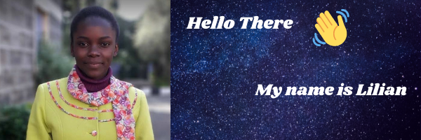

A full stack software developer student at Microverse and also an undergraduate in Kenyatta University pursuing Computer Science. 

 
<a target="_blank"
href="https://www.linkedin.com/in/lilian-moraa-99950b1b8"></img></a>

<a target="_blank"
href="mailto:lilyondie@gmail.com"></img></a>

<a target="_blank"
href=" https://www.Twitter.com/LilianM53742529"></img></a>

✨ _special_ ✨ repository because its `README.md` (this file) appears on your GitHub profile.

Here are some ideas to get you started:

- 🔭 I’m currently working on ...
- 🌱 I’m currently learning ...
- 👯 I’m looking to collaborate on ...
- 🤔 I’m looking for help with ...
- 💬 Ask me about ...
- 📫 How to reach me: ...
- 😄 Pronouns: ...
- ⚡ Fun fact: ...
-->
